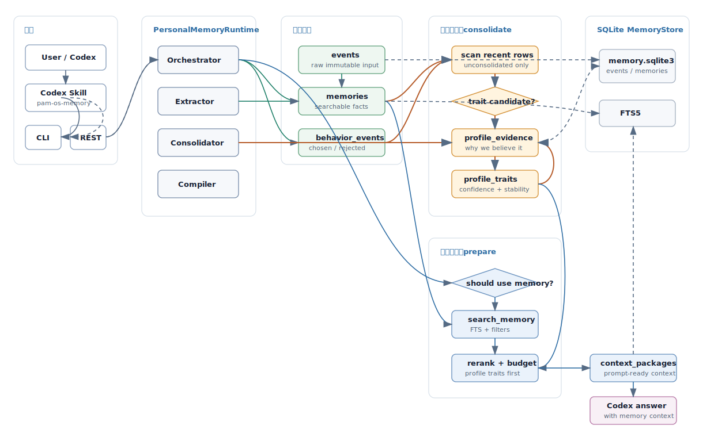

<div align="center">
  <h1>PAM-OS</h1>
  <p><strong>个人 AI 记忆操作系统：面向 AI Agent 的本地优先、REST-only 记忆运行时。</strong></p>
  <p>
    <a href="README.md">English</a> ·
    <a href="docs/usage.md">使用文档</a> ·
    <a href="https://github.com/danzhewuju/PAM-OS">GitHub</a>
  </p>
  <p>
    <a href="LICENSE"></a>
    
    
    
  </p>
</div>

---

PAM-OS 为 AI 助手提供一个可持久化的个人记忆服务。客户端在任务前后通过 REST 调用它；PAM-OS 负责保存原始事件、提取结构化记忆、检索相关上下文、巩固稳定画像、学习何时使用记忆，并返回可直接注入提示词的上下文包。

```text
AI 客户端 / Skill
  -> PAM-OS REST API (/v2)
  -> Bearer API Key / 认证用户上下文
  -> 用户专属 PersonalMemoryRuntime
  -> 自适应策略 + Provider 管线
  -> SQLite MemoryStore
  -> 上下文包 / 捕获结果 / 用户画像
```



## 主要特点

- **本地优先**：个人数据保存在用户控制的 SQLite 数据库中。
- **统一 REST 边界**：客户端不再执行本地 PAM-OS 命令。
- **回答前准备上下文**：自动判断是否需要读取记忆并进行预算裁剪。
- **回答后选择性写入**：保存稳定偏好、目标、项目决策、风格和纠正，跳过临时闲聊。
- **用户画像巩固**：重复证据和行为选择可以提升为稳定画像特征。
- **自适应策略记忆**：学习可复用的读取、写入和抑制信号。
- **可替换 Provider**：策略、抽取、检索、重排和巩固仍保持协议无关。

## 快速启动

要求：

- Python 3.11 或更高版本
- 建议使用支持 FTS5 的 SQLite
- 推荐使用 `uv`

安装依赖并启动 REST API：

```bash
uv sync
export PAM_OS_BOOTSTRAP_TOKEN='replace-with-a-long-random-secret'
uv run python -m uvicorn pam_os.api:create_app --factory --host 127.0.0.1 --port 8765
```

检查服务：

```bash
curl http://127.0.0.1:8765/health/live
curl -sS -X POST http://127.0.0.1:8765/v2/admin/users \
  -H "Authorization: Bearer $PAM_OS_BOOTSTRAP_TOKEN" \
  -H 'Content-Type: application/json' \
  -d '{"username":"alice","principal_name":"admin","scopes":["admin:users","api_keys:manage","memory:read","memory:write","memory:delete","memory:inspect"]}'
```

创建用户的响应只返回一次 API Key。请安全保存，并在创建用户绑定的管理员密钥后移除 Bootstrap Token。

OpenAPI 页面位于 `http://127.0.0.1:8765/docs`。

## 推荐 Agent 工作流

回答依赖历史的任务前准备上下文：

```bash
curl -sS -X POST http://127.0.0.1:8765/v2/context/prepare \
  -H 'Authorization: Bearer <api-key>' \
  -H 'Content-Type: application/json' \
  -d '{"task":"按我的偏好规划 PAM-OS 下一步。","force":false}'
```

完成重要回答后观察整个轮次：

```bash
curl -sS -X POST http://127.0.0.1:8765/v2/turns/observe \
  -H 'Authorization: Bearer <api-key>' \
  -H 'Content-Type: application/json' \
  -d '{"user_message":"我偏好本地优先系统。","assistant_message":"收到。","auto_capture":true,"auto_learn_policy":true}'
```

用户明确要求记住或导入内容时直接捕获：

```bash
curl -sS -X POST http://127.0.0.1:8765/v2/memory/capture \
  -H 'Authorization: Bearer <api-key>' \
  -H 'Content-Type: application/json' \
  -d '{"content":"用户偏好本地优先、轻量、可控的技术方案。","source":"assistant","force":true}'
```

## Plugin 与 Skill

`pam-os-memory` skill 负责告诉 Codex、Claude Code、OpenCode 和 Hermes 什么时候读取、写入和观察记忆。配置文件会记录已安装的 skill/API 版本、安装时探测到的服务端版本，以及 REST 参数：

```toml
[versions]
skill = "0.5.0"
api = "v2"
server = "0.5.0"
server_api = "v2"
server_checked_at = "2026-07-18T00:00:00Z"
status = "match"

[rest]
url = "http://127.0.0.1:8765"
token = ""
timeout_seconds = 10
```

远程安装：

```bash
curl -fsSL https://raw.githubusercontent.com/danzhewuju/PAM-OS/refs/heads/master/scripts/install.sh | bash
```

从当前 checkout 安装：

```bash
./scripts/install.sh --repo-dir "$PWD" --yes
```

Windows PowerShell：

```powershell
.\scripts\install.ps1 --repo-dir $PWD --yes
```

两个平台安装器同时负责首次安装和更新。未指定目标时，它们会自动识别已有集成并更新全部已安装目标；首次安装则交互选择目标，或在使用 `--yes` 时默认安装 Codex。安装器会沿用已有 skill 的 REST URL、Bearer Token 和超时，刷新托管 checkout，探测服务端元数据，并写入可观测的版本快照。命令行参数和 `PAM_OS_REST_*` 环境变量优先级更高。远程服务必须使用 HTTPS，并避免把 Token 直接写进 shell 历史。

## REST API

正式接口统一使用 `/v2`，不再提供 v1 或无版本兼容路由。

| 方法 | 路径 | 用途 |
| --- | --- | --- |
| `GET` | `/health/live` | 公开存活检查。 |
| `GET` | `/v2/health/ready` | 认证后的数据库就绪检查。 |
| `GET` | `/v2/meta` | 运行时与 API 版本。 |
| `GET` | `/v2/me` | 当前认证用户、Principal、API Key 与 scopes。 |
| `POST` | `/v2/admin/users` | 创建用户及其首个 API Key。 |
| `POST` | `/v2/events` | 写入原始事件并按需抽取记忆。 |
| `POST` | `/v2/memories/search` | 按类型和分数条件搜索记忆。 |
| `POST` | `/v2/memory/should-use` | 判断任务是否需要使用记忆。 |
| `POST` | `/v2/context/prepare` | 准备可注入提示词的上下文。 |
| `POST` | `/v2/memory/capture` | 选择性捕获稳定记忆。 |
| `POST` | `/v2/behavior/choice` | 记录行为选择证据。 |
| `POST` | `/v2/turns/observe` | 观察一个完整对话轮次。 |
| `POST` | `/v2/memory/consolidate` | 将证据巩固为画像。 |
| `GET` | `/v2/profile` | 读取画像特征。 |
| `POST` | `/v2/context/compile` | 直接检索并编译上下文。 |
| `POST` | `/v2/reflect` | 从近期记忆构建反思上下文。 |
| `GET` | `/v2/storage/stats` | 查看存储统计。 |
| `GET` | `/v2/memory/inspect` | 查看记忆表和质量轨迹。 |
| `POST` | `/v2/memory/clear` | 显式确认后清空全部记忆。 |

请求模型会拒绝未知字段和超大请求体，并限制文本长度、分数范围和结果条数。参数校验和运行时/存储错误会返回结构化错误。

## 安全模型

PAM-OS v0.5 使用 Bearer API Key 将调用方 Principal 固定绑定到用户，并为每个用户路由到独立、带 owner 标记的 SQLite。业务请求不接受 `user_id` 或 `X-PAM-OS-User`。

在 `config/pam-os.toml` 设置一次性 Bootstrap Token：

```toml
[server]
host = "127.0.0.1"
port = 8765
bootstrap_token = "replace-with-a-long-random-secret"
```

也可以使用环境变量：

```bash
export PAM_OS_BOOTSTRAP_TOKEN='replace-with-a-long-random-secret'
```

Bootstrap Token 仅用于创建首个用户及用户绑定的管理员密钥，完成后应删除。服务只要离开 localhost，就必须通过 HTTPS、TLS 反向代理或可信私网访问。

## SQLite 并发基础

身份控制库和每个用户的记忆库都使用 SQLite 短连接、外键、busy timeout 与 WAL。用户数据库按内部不可变 ID 物理隔离。

## Docker

```bash
docker build -t pam-os .
docker volume create pam-os-data
docker run -d --name pam-os \
  -p 8765:8765 \
  -v pam-os-data:/data \
  -e PAM_OS_BOOTSTRAP_TOKEN='replace-with-a-long-random-secret' \
  pam-os
```

容器直接启动 ASGI factory，身份控制库和用户数据库都位于 `/data`。

## 配置

```bash
cp config/pam-os.example.toml config/pam-os.toml
```

优先级为：环境变量 > `config/pam-os.toml` > 内置默认值。

```bash
export PAM_OS_DATA_DIR="$HOME/.pam-os"
export PAM_OS_BOOTSTRAP_TOKEN='replace-with-a-long-random-secret'
export PAM_OS_CONFIG="/path/to/pam-os.toml"
export PAM_OS_HOST="0.0.0.0"
export PAM_OS_PORT="8765"
```

完整配置见 [config/pam-os.example.toml](config/pam-os.example.toml)。

## 项目结构

```text
src/pam_os/
  api.py             # REST API、请求校验、认证、健康检查、错误处理
  runtime.py         # 协议无关的记忆运行时
  store.py           # SQLite schema、写入、检索和诊断
  orchestrator.py    # 策略、检索、重排和上下文预算
  providers.py       # 可替换 Provider 接口
  adaptive_policy.py # 学习信号与规则 fallback
  rule_provider.py   # 默认本地 Provider
  extractor.py       # 规则抽取器
  context.py         # 上下文编译器
```

## 开发

```bash
uv sync --extra dev
uv run pytest
```

质量评估保留为 Python 开发接口 `pam_os.quality.evaluate_quality_cases`，不再作为产品命令暴露。

## 更新

再次运行同一个安装器即可。它会识别已有目标、更新托管 checkout、重装集成，并刷新 skill/服务端版本快照：

```bash
curl -fsSL https://raw.githubusercontent.com/danzhewuju/PAM-OS/refs/heads/master/scripts/install.sh | bash
```

## License

PAM-OS 使用 [Apache License 2.0](LICENSE)。
