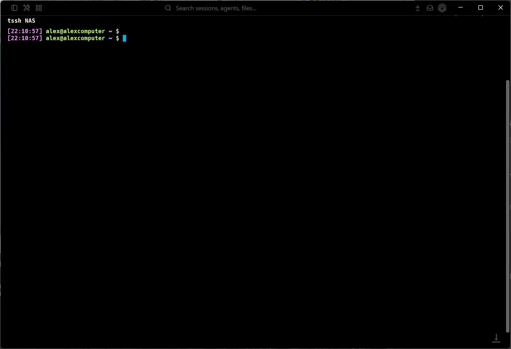

<div align="center">
  <h1>PAM-OS</h1>
  <p><strong>个人 AI 记忆操作系统：面向 AI Agent 的本地优先记忆运行时。</strong></p>
  <p>
    <a href="README.md">English</a> ·
    <a href="docs/usage.md">文档</a> ·
    <a href="https://github.com/danzhewuju/PAM-OS">GitHub</a>
  </p>
  <p>
    <a href="LICENSE"></a>
    
    
    
    
  </p>
  <p>
    <a href="#安装">快速开始</a> ·
    <a href="#使用演示">使用演示</a> ·
    <a href="#记忆架构">记忆架构</a> ·
    <a href="#推荐-agent-工作流">Agent 工作流</a> ·
    <a href="#rest-api">REST API</a> ·
    <a href="#文档">文档</a> ·
    <a href="#license">License</a>
  </p>
</div>

---

PAM-OS 为助手提供一个可持久化的记忆层，可在任务前后调用。它会存储原始事件、提取结构化记忆、检索相关上下文、合并稳定的用户画像特征、学习何时应该使用记忆，并通过 CLI、MCP 或 REST 返回可直接放入提示词的上下文包。

```text
Task/Event
  -> Adaptive Memory Policy
       |-- Learned Policy Signals
       `-- Rule Policy Fallback
  -> Memory Extraction / Retrieval / Reranking
  -> SQLite Store
       |-- Memories
       |-- Behavior Evidence
       |-- Profile Traits
       `-- Policy Signals
  -> Context Package
```


## 为什么选择 PAM-OS？

大多数 AI 工具默认是无状态的，除非每个客户端都自行实现一套记忆系统。PAM-OS 是一个轻量运行时，把记忆放在模型之外，也放在任意单一聊天客户端之外。

- **本地优先**：数据默认存放在本地 SQLite 数据库 `~/.pam-os/memory.sqlite3`。
- **Agent 友好**：可通过打包插件、MCP 工具或 Skill fallback 在 Codex 中使用。
- **可直接用于提示词的检索**：`prepare` 会判断是否需要记忆、检索记忆、应用预算限制并输出上下文文本。
- **选择性写入**：`capture` 只保存稳定偏好、目标、项目决策、风格指导和纠正信息，跳过临时对话。
- **用户画像合并**：用户选择和重复证据可以被提升为稳定的用户画像特征。
- **自适应策略记忆**：PAM-OS 可以从交互模式中学习可复用的读取和写入信号，而不只依赖固定关键词。
- **Provider 管线**：策略、检索、重排、提取和合并都是可替换接口，默认使用本地规则 provider 作为 fallback。
- **协议无关核心**：同一个运行时同时支撑 CLI、REST API 和 MCP。
- **无需外部服务**：核心运行时只依赖 Python 和 SQLite。

## 安装

环境要求：

- Python 3.11 或更新版本
- 推荐使用 `uv` 进行本地执行
- 建议使用支持 FTS5 的 SQLite

## 使用演示



### 插件 + MCP（建议）

适用于 Codex、Claude Code、OpenCode 或 Hermes 集成。安装器会在 `~/.local/share/pam-os/repo` 维护一个托管的 PAM-OS checkout，安装所选客户端集成，并让支持 MCP 的客户端指向同一份 checkout，从而保持插件、Skill 和运行时版本一致。

```bash
curl -fsSL https://raw.githubusercontent.com/danzhewuju/PAM-OS/refs/heads/master/scripts/install-plugin.sh | bash
```

本地开发时，如果想直接用当前 checkout 的改动安装测试，而不是先 push 再 curl 远程脚本：

```bash
scripts/install-plugin-local.sh
```

Windows PowerShell 下可以使用：

```powershell
.\scripts\install-plugin-local.ps1
```

### 更新

查看当前安装版本，并和 GitHub 最新 Release 对比：

```bash
memory version
memory update-check
```

刷新托管 checkout 并重新安装集成：

```bash
curl -fsSL https://raw.githubusercontent.com/danzhewuju/PAM-OS/refs/heads/master/scripts/update.sh | bash
```

如果想固定安装某个 Release tag：

```bash
curl -fsSL https://raw.githubusercontent.com/danzhewuju/PAM-OS/refs/heads/master/scripts/update.sh | bash -s -- --ref v0.2.1
```

## 核心概念

| 概念 | 含义 |
| --- | --- |
| Event / 事件 | 来自对话、工具、导入或 API 调用的原始输入记录。 |
| Memory / 记忆 | 从事件中提取的结构化长期信息。 |
| Behavior event / 行为事件 | 被记录为行为证据的用户选择、拒绝或延后决定。 |
| Profile evidence / 画像证据 | 用于支撑画像特征的中间证据。 |
| Profile trait / 画像特征 | 对用户偏好、风格、目标或决策模式的稳定描述。 |
| Policy signal / 策略信号 | 用于判断何时读取、写入、抑制或合并记忆的学习规则。 |
| Context package / 上下文包 | 为特定任务编译好的、可直接用于提示词的文本。 |

记忆类型包括 `identity`、`preference`、`goal`、`project`、`style`、`episodic` 和 `semantic`。

## 记忆架构

PAM-OS 使用 provider 管线，而不是把记忆行为硬编码到单个规则模块中：

```text
Task/Event
  -> MemoryPolicy
  -> MemoryExtractor
  -> MemoryStore
  -> MemoryRetriever
  -> MemoryReranker
  -> ContextCompiler
  -> ProfileConsolidator
```

默认运行时仍然是本地且确定性的。`AdaptiveMemoryPolicy` 会提取语义策略特征，检查已学习的策略信号，对特征级决策打分，然后 fallback 到规则策略。这样 PAM-OS 可以从历史交互中学习类似 "continue that thread"、"use the same style as before" 或 "remember this for next time" 的表达，同时保留离线基线能力。

Provider 接口位于 `pam_os.providers`：

- `MemoryPolicy`：判断任务是否应该读取或写入记忆。
- `MemoryExtractor`：从事件中提取带类型的记忆。
- `MemoryRetriever`：检索候选记忆。
- `MemoryReranker`：在预算限制前对候选记忆排序。
- `ProfileConsolidator`：将证据提升为稳定画像特征。

默认规则实现位于 `pam_os.rule_provider`。未来的 LLM 或 embedding provider 可以接入同一套接口，而无需修改 CLI、MCP、REST 或公开运行时方法。

### 策略记忆层

策略记忆是关于“如何使用记忆”的记忆。它以 `policy_signals` 的形式存储在 SQLite 中：

```text
signal_type       read / capture / consolidate / suppress
scope             project / style / workflow / technical / general
pattern           literal text, regex:..., or feature:<feature_name>
normalized_intent stable meaning of the pattern
action            use_memory / capture_memory / skip / consolidate
confidence        current belief strength
support_count     positive evidence
reject_count      negative evidence
source            seed / user_feedback / observed_behavior / llm
status            candidate / active / stable / archived
```

运行时代码可以直接学习新的信号：

```python
runtime.learn_policy_signal(
    signal_type="read",
    pattern="沿着 Aurora 那条线",
    normalized_intent="continue_project_thread",
    action="use_memory",
    scope="project",
    confidence=0.72,
)
```

之后，即使该请求没有命中种子关键词规则，包含 “沿着 Aurora 那条线” 的请求也能触发记忆检索。信号也可以随着时间被强化或否定：

运行时代码还可以从观察到的短语中学习；如果存在可复用的特征级信号，就将其存储下来：

```python
runtime.learn_policy_signal_from_text(
    signal_type="read",
    text="same one please",
    normalized_intent="short_followup_continuation",
    action="use_memory",
    scope="workflow",
    confidence=0.70,
)
```

这可以存储为 `feature:short_followup`，因此之后类似 "that one please" 的表达也能触发同样的学习行为，而不需要记住每一种措辞。

```python
runtime.reinforce_policy_signal(
    signal_type="read",
    pattern="沿着 Aurora 那条线",
    action="use_memory",
    supported=True,
)
```

这是可选 LLM teacher 的本地基础。未来的 LLM provider 可以提出候选策略信号，但 PAM-OS 会在本地用置信度、证据计数和状态转换来存储并评估它们。

## 推荐 Agent 工作流

当任务依赖用户偏好、历史决策、进行中的项目、长期目标、回答风格或早期对话历史时，在回答前使用 `prepare`：

```bash
uv run --python 3.12 memory prepare "Plan the next PAM-OS milestone based on my preferences." --json
```

当对话中包含值得保留的稳定信息时，在回答后使用 `capture`：

```bash
uv run --python 3.12 memory capture "The user prefers local-first, lightweight, controllable technical designs."
```

当用户在多个选项中做出选择时，记录该选择：

```bash
uv run --python 3.12 memory behavior-choice \
  --context "PAM-OS storage roadmap" \
  --chosen "SQLite FTS5" \
  --rejected "Qdrant" \
  --reason "Keep the MVP local and lightweight."
```

将近期证据合并为画像特征：

```bash
uv run --python 3.12 memory consolidate --recent 100
uv run --python 3.12 memory profile
```

## Codex 插件与 MCP

仓库包含一个 Codex 插件包：

```text
plugins/pam-os-memory/
  .codex-plugin/plugin.json
  .mcp.json
  skills/pam-os-memory/SKILL.md
```

推荐集成方式：

```text
Codex Plugin
  |-- MCP server registration  # tool execution
  `-- pam-os-memory skill      # memory usage policy
```

可用 MCP 工具：

- `prepare_context`
- `capture_memory`
- `record_behavior_choice`
- `consolidate_memory`
- `get_profile`
- `search_memory`
- `inspect_memory`
- `get_storage_stats`

也可以直接运行 MCP server：

```bash
uv run --python 3.12 pam-os-mcp --db ~/.pam-os/memory.sqlite3
```

或通过 `memory` CLI 启动：

```bash
uv run --python 3.12 memory --db ~/.pam-os/memory.sqlite3 mcp
```

## CLI 参考

```text
memory init
memory add <content> [--source manual] [--metadata-json {...}]
memory search <query> [--limit 10] [--type project]
memory should-use <task>
memory prepare <task> [--conversation-summary ...] [--force] [--limit 12] [--max-chars 4000] [--json]
memory capture <content> [--source conversation] [--metadata-json {...}] [--force]
memory behavior-choice --context <context> --chosen <option> [--rejected <option>] [--deferred <option>]
memory consolidate [--recent 100]
memory profile [--limit 20] [--query <query>]
memory compile <task> [--limit 12]
memory reflect [--recent 50]
memory stats
memory inspect [--table all] [--limit 20] [--query <query>] [--json]
memory serve [--host 127.0.0.1] [--port 8765]
memory mcp
```

全局选项放在子命令之前：

```bash
uv run --python 3.12 memory --db ~/.pam-os/memory.sqlite3 stats
uv run --python 3.12 memory --config config/pam-os.toml prepare "Continue PAM-OS"
```

## REST API

安装可选 API 依赖并启动 server：

```bash
uv run --python 3.12 --extra api memory serve --host 127.0.0.1 --port 8765
```

健康检查：

```bash
curl http://127.0.0.1:8765/health
```

核心端点：

| Method | Path | 用途 |
| --- | --- | --- |
| `GET` | `/health` | 健康状态、数据库路径和 FTS 状态。 |
| `GET` | `/storage/stats` | 存储统计信息。 |
| `GET` | `/memory/inspect` | 查看表和诊断行。 |
| `POST` | `/events` | 添加原始事件，并可选择提取记忆。 |
| `GET` | `/memories/search?q=...` | 搜索记忆。 |
| `GET` | `/memory/should-use?task=...` | 判断任务是否应该使用记忆。 |
| `POST` | `/context/prepare` | 准备可直接用于提示词的记忆上下文。 |
| `POST` | `/memory/capture` | 选择性写入稳定记忆。 |
| `POST` | `/behavior/choice` | 将选择记录为行为证据。 |
| `POST` | `/memory/consolidate` | 将记忆和行为合并为画像特征。 |
| `GET` | `/profile` | 读取画像特征。 |
| `POST` | `/context/compile` | 直接从搜索结果编译上下文。 |
| `POST` | `/reflect` | 将近期记忆总结为上下文。 |
| `POST` | `/memory/clear` | 经确认后清空全部记忆数据。 |

### Docker 部署

从当前 checkout 构建镜像：

```bash
docker build -t pam-os .
```

默认基础镜像使用 DaoCloud 的 Docker Hub 国内镜像。如果需要切换成其他基础镜像源：

```bash
docker build \
  --build-arg PYTHON_BASE_IMAGE=python:3.12-slim \
  --build-arg PIP_INDEX_URL=https://pypi.org/simple \
  -t pam-os .
```

在服务器上启动 REST API，并用 Docker volume 持久化 SQLite：

```bash
docker volume create pam-os-data
docker run -d --name pam-os \
  -p 8765:8765 \
  -v pam-os-data:/data \
  -e PAM_OS_AUTH_ENABLED=true \
  -e PAM_OS_AUTH_USERNAME=user \
  -e PAM_OS_AUTH_PASSWORD=change-me \
  pam-os
```

容器默认监听 `0.0.0.0:8765`，数据写入 `/data/memory.sqlite3`。如果服务不只暴露给本机，建议开启 Basic Auth。

```bash
curl -u user:change-me http://SERVER_IP:8765/health
```

## 配置

复制示例配置：

```bash
cp config/pam-os.example.toml config/pam-os.toml
```

配置优先级：

```text
CLI arguments > environment variables > config/pam-os.toml > built-in defaults
```

常用环境变量：

```bash
export PAM_OS_DB="$HOME/.pam-os/memory.sqlite3"
export PAM_OS_CONFIG="/path/to/pam-os.toml"
export PAM_OS_HOST="0.0.0.0"
export PAM_OS_PORT="8765"
export PAM_OS_AUTH_ENABLED="true"
export PAM_OS_AUTH_USERNAME="user"
export PAM_OS_AUTH_PASSWORD="change-me"
```

重要配置段：

| 配置段 | 用途 |
| --- | --- |
| `[storage]` | SQLite 数据库路径。 |
| `[server]` | REST host、端口和可选 Basic Auth。 |
| `[context]` | 记忆数量、上下文字数预算和画像注入限制。 |
| `[consolidation]` | 证据扫描窗口和画像稳定性增长设置。 |
| `[orchestrator]` | 读取/写入阈值和候选扩展设置。 |
| `[retrieval]` | 查询词提取设置。 |
| `[profile]` | 默认画像查询数量限制。 |

完整模板见 [config/pam-os.example.toml](config/pam-os.example.toml)。

## 项目结构

```text
PAM-OS/
  src/pam_os/
    runtime.py        # 协议无关记忆运行时
    store.py          # SQLite schema、写入、检索、检查
    providers.py      # 策略、检索、重排、提取、合并的 provider 协议
    adaptive_policy.py # 学习策略信号与规则 fallback
    rule_provider.py  # 默认本地规则 provider
    extractor.py      # 默认本地记忆提取器
    orchestrator.py   # provider 管线协调与上下文预算
    context.py        # 可用于提示词的上下文编译器
    consolidator.py   # 默认画像合并器兼容包装
    cli.py            # memory CLI
    api.py            # REST API
    mcp.py            # MCP stdio server
  plugins/
    pam-os-memory/    # Codex 插件包
  skills/
    pam-os-memory/    # 独立 Skill 包
  docs/
    usage.md          # 完整使用指南
    design/           # 设计笔记
  tests/
```

## 开发

运行测试：

```bash
uv run --python 3.12 --extra dev pytest
```

运行聚焦的诊断检查：

```bash
uv run --python 3.12 memory stats
uv run --python 3.12 memory inspect --limit 20
```

## 路线图

PAM-OS 目前刻意保持小而清晰。当前运行时是构建更大个人记忆层的可执行基础：

- provider 接口背后更丰富的提取能力
- 可选 LLM policy teacher，用于提出可学习的策略信号
- 可选 embedding 和混合检索 provider
- 通过画像合并 provider 改进合并和矛盾处理
- 更广泛的 MCP 和客户端打包
- 导入、导出和迁移工具
- 更强的记忆质量和检索行为诊断能力

## 文档

- [使用指南](docs/usage.md)
- [Skill 与插件指南](docs/pam-os-skill-usage.md)
- [画像记忆设计](docs/design/people-understanding-profile-memory.md)

## License

PAM-OS 使用 [Apache License 2.0](LICENSE) 开源。

## 链接


